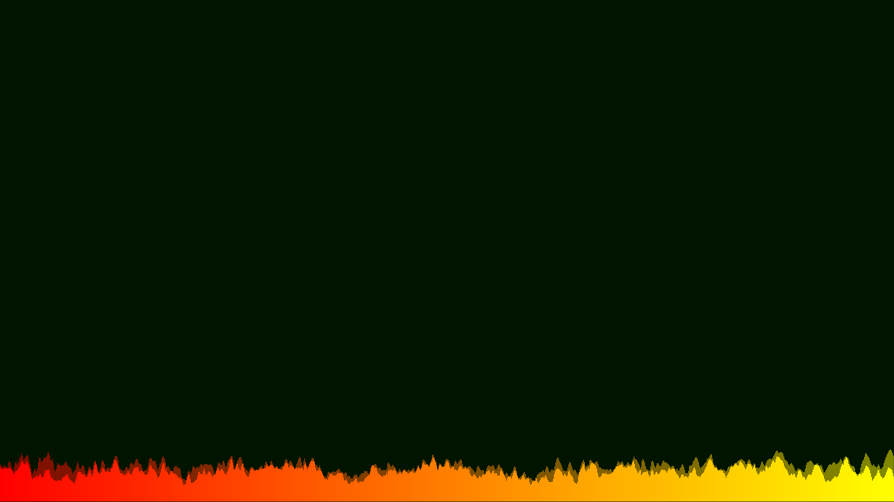
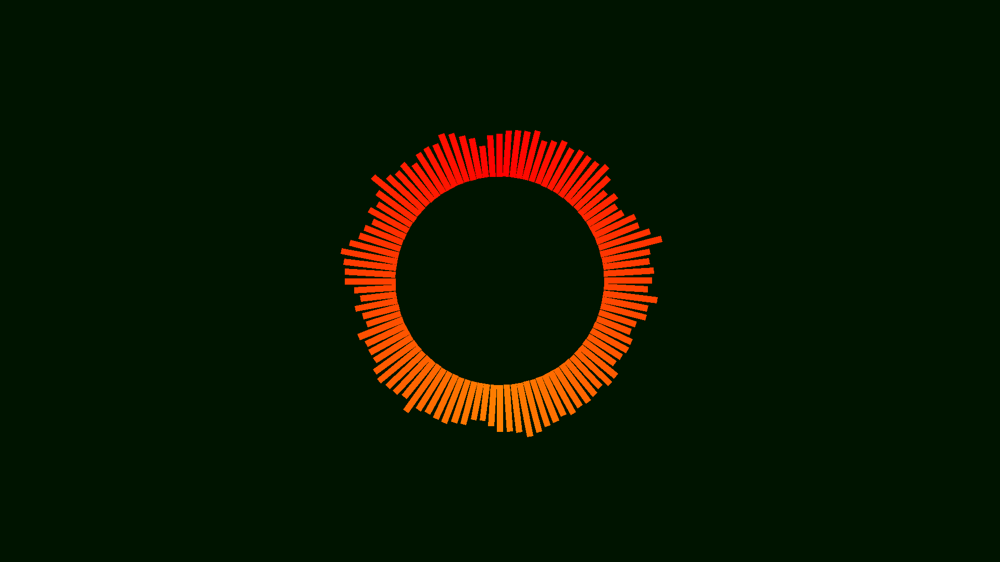
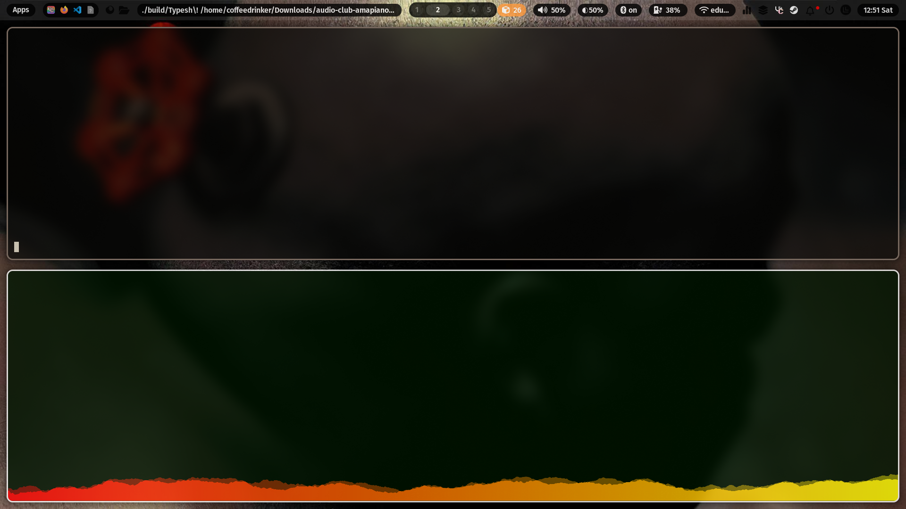

# Typesh!

# Installation
```sh
git clone https://github.com/wyattros/Typeshi.git
cd Typeshi && make
```

# Use
```sh
cd build/
./Typesh! my_awesome_wav_file.wav
```
## Flags
-  -c Makes the visualisation circular
-  -f Enables the fade effect
-  -b x Let's you define the number of bars
-  -g x Let's you define the gap between each bars (in pixels)

# Demo
| Flat                            | Circular                                | On a desktop                   |
| ------------------------------------ | -------------------------------------------- | ------------------------------------- |
|  |  |  |
